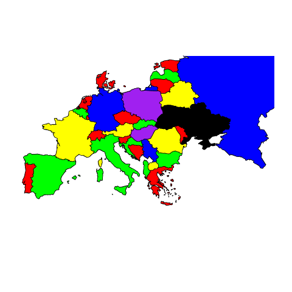
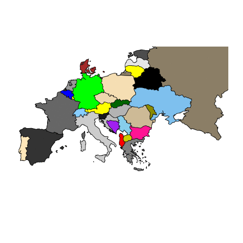

```{r setup, include=FALSE}
knitr::opts_chunk$set(echo = TRUE)
```

#Planteamiento del problema

Vamos a realizar el coloreado del mapa de Europa de 31 países, vamos a realizar el planteamiento del problema lineal.

$$x_{ih} = \begin{cases} 1, \text{Si la región i tiene el color h} \\
0, \text{caso contrario}  \end{cases}$$

$$y_h = \begin{cases} 1, \text{Si el color h esta asignado} \\
0, \text{caso contrario}  \end{cases}$$

La objetivo es minimizar la función objetivo 


$$ \text{Min} \; \sum_{h=1}^k y_h $$
Esta función ha de ser minimizada con unas condiciones. Una de ella es que necesariamente todos los países tengan un color. 
$$ \sum_{h=1}^k x_{ih} = 1$$.
La siguiente condición es que un país coloreado con un color $h$ no puede tener un vecino coloreado con un color $h$. Por ello se define un conjunto $A$ tal que si los países $i$ y $j$ son vecinos entonces $(i,j) \in A$. Ahora podemos expresar esto matemáticamente.
$$ x_{ih} + x_{jh} \leq 1 \quad \text{para }(i,j) \in A, \text{para todo h}$$.

Otra condición un tanto obvia es que si un país tiene un color asignado, ese color se esta usando. Podemos expresar esto de la forma 
$$ x_{ih} \leq y_h \forall i, \forall h$$
Por último 
$$x_{ih} \in \{0,1\} \quad , \quad y_h \in \{0,1\}$$


#Resolución del problema
```{r}
library(maps)
library(animation)

fronteras <- read.csv("Datos.csv", header = T)
rownames(fronteras)  <- fronteras$X
fronteras <- fronteras[2:length(fronteras)]
nombres_paises<-c("Albania","Germany","Austria","Belgium","Belarus","Bosnia","Bulgaria","Croatia","Denmark",
          "Slovakia","Slovenia","Spain","Estonia","France","Greece","Netherlands","Hungary","Italy","Latvia",
          "Lithuania","Luxembourg","Macedonia","Moldova","Poland","Portugal","Czech Republic","Romania",
          "Russia","Serbia","Switzerland","Ukraine")
```


```{r, tidy=T}
gen_sol <- function(k) { #General sol aleatoria de k colores
  sol <- numeric(length(fronteras))
  sol <- sample(1:k, replace = F, size = length(fronteras)) 
  return(sol)
}

gen_greedy_sol <- function(orden_max) {
  sol <-  numeric(length(fronteras))
  for (i in orden_max) {
    color = 1
    
    while (sol[i] == 0) {
      if (check_color(sol, color = color, i)) sol[i] = color
      else color = color + 1
    }
    
  }
  return(sol)
}

coste <- function(sol) {
  #+ check_sol(sol) * 10
  length(unique(sol)) 
}


check_sol <- function(sol) { #Comprueba si la solucion respeta colores adyacentes.
  n_wrong <- 0
  for (i in seq(length(fronteras))) {
    paises_vecinos <- which(fronteras[,i]== 1)[which(fronteras[,i]==1) != i] #Lista de paises vecinos del pais i
    if (sol[i] %in% sol[paises_vecinos]) { n_wrong <- n_wrong + 1 } 
  }
  return(n_wrong)
}


check_color <- function(sol, color, pais) { #Comprueba si el color se puede asignar
  # [which(fronteras[,pais]==1) != pais]
  paises_frontera <- which(fronteras[,pais]==1)[which(fronteras[,pais]==1) != pais]
  if (color %in% sol[paises_frontera]) return(F)
  else return(T)
}


gen_sol_vecina <- function(sol) { #Toma un pais aleatorio, y colorea sus vecinos de forma aleatoria
  buena <- F
  
  while(!buena) {
    sol2 <- sol
    pais_random <- sample(seq(length(fronteras)),1)
    vecinos <- which(fronteras[,pais_random]==1)[which(fronteras[,pais_random]==1) != pais_random]
    if (length(vecinos) > 1) {
      colores_vecinos <- sol[vecinos]
      nuevos_colores <- sample(max(colores_vecinos), replace = T, size=length(vecinos))
      sol2[vecinos] <- nuevos_colores
      if (check_sol(sol2)==0) buena=T
      
    }
  }

  return(sol2)
  
}


plot_map <- function(sol) { #Función que representa gráficamente el mapa
  colors<-c("red","green","yellow","blue","black","purple","deeppink","grey","brown", "darkgreen","grey10","grey20","grey30","grey40","grey50","grey60","grey70","grey80","grey90", "yellow1","yellow2", "yellow3","yellow4","wheat","wheat1","wheat2","wheat3","wheat4","skyblue","skyblue1", "skyblue2")
  map("world",nombres_paises,fill = F,xlim = c(-10,50),ylim = c(30,60))
  for (i in 1:length(nombres_paises)) map("world",nombres_paises[i] , col=colors[sol[i]], fill=TRUE, add=TRUE)
}

#Creamos un vector con el numero de fronteras que tiene cada pais
n_fronteras <- c()
for (i in seq(length(fronteras))) {
  n_fronteras <- c(n_fronteras,length(which(fronteras[,i]== 1)[which(fronteras[,i]==1) != i]) )
}

#Creamos un vector con los paises ordenados segun el numero de fronteras
orden_max <- c()
for (i in sort(unique(n_fronteras), decreasing = T)) {
  orden_max <- c(orden_max,which(n_fronteras == i))
}

```


#Greedy

Vamos a comenzar buscando la solución greedy. Para ello vamos a asignar el primer color de la lista de colores siempre que se pueda. cuando no se pueda asignar el primero se asignara el segundo. Esta lógica se ira repitiendo con todos los países. Por lo tanto el algoritmo siempre va a buscar la mejor solución que tiene a la vista sin mirar mas allá del país que se esta procesando actualmente.
```{r, tidy=T}
sol = numeric(length(fronteras))
for (i in seq(length(fronteras))) {
  color = 1
  
  while (sol[i] == 0) {
    if (check_color(sol, color = color, i)) sol[i] = color
    else color = color + 1
  }

}

require(maps)
names(sol) <- names(fronteras)
sol
plot_map(sol)
```

Obtenemos una solución de cinco países como podemos ver en el mapa. Podemos realizar un algoritmo más inteligente abordando primero los países con más fronteras.


```{r, tidy=T}
sol = numeric(length(fronteras))
for (i in orden_max) {
  color = 1
  
  while (sol[i] == 0) {
    if (check_color(sol, color = color, i)) sol[i] = color
    else color = color + 1
  }

}

names(sol) <- names(fronteras)
sol
plot_map(sol)
```

Vemos que la solución *greedy* nos da la solución optima de cuatro colores si calculamos en orden de número de fronteras (mayor a menor). Por otra parte si repetimos el calculo pero invirtiendo el orden obtenemos una solución de seis colores.


```{r, tidy=T}
sol = numeric(length(fronteras))
for (i in rev(orden_max)) {
  color = 1
  
  while (sol[i] == 0) {
    if (check_color(sol, color = color, i)) sol[i] = color
    else color = color + 1
  }

}

names(sol) <- nombres_paises
sol
plot_map(sol)
```

Estas soluciones con soluciones no globales pueden ser mejoradas recalculando soluciones de forma aleatorias. En lugar de realizar este proceso a continuación con lo que tendríamos efectivamente un método GRASP. Vamos a emplear el método *simulated annealing* en la búsqueda de nuevas soluciones. El motivo de esta decisión es que el método annealing es muy similar al GRASP con el añadido del concepto de temperatura. Debido a esto, al mostrar este método se muestra indirectamente el método GRASP.


#Simulated Annealing


Ahora vamos a emplear el método simulated annealing, para ello vamos a comenzar con una solución local del problema de 6 colores que obtenemos empleando la solución greedy pero en lugar de colorear los mapas por orden decreciente en número de fronteras lo colorearemos por orden ascendente. El motivo de esto es comenzar con una solución que pueda ser mejorada mediante un proceso iterativo. 

```{r, tidy=T}

sim_anne <- function(max_iteracion, max_equilibrio, temp, alpha, sol_inicial) {
  iteracion <- 0
  #Listas 
  list_temp <- c()
  list_coste <- c()
  list_color <- c()
  list_probs <- c()
  list_sols <- c()
  
  #Genero solución local
  sol <- sol_inicial
  list_sols <- c(list_sols, sol)
  best_sol <- sol
  while(iteracion < max_iteracion) {
    equilibrio <- 0
    while (equilibrio < max_equilibrio) {
      list_color <- c(list_color, length(unique(sol)))
      list_coste <- c(list_coste, coste(sol))
      sol2 <- gen_sol_vecina(sol)
      diff <- coste(sol2) - coste(sol)
      if (diff < 0) {
        best_sol <- sol2
        sol <- sol2
        list_sols <- c(list_sols, sol)
      }
      else {
        proba <- exp(-diff/temp)
        if (runif(1,0,1) < proba) {
          sol <- sol2
          list_probs <- c(list_probs, proba)
          # list_sols <- c(list_sols, sol)
        }
      }
      equilibrio <- equilibrio + 1
      list_temp <- c(list_temp,temp)
    }
    
    temp <- temp * alpha
    # sol <- best_sol
    iteracion <- iteracion + 1
  }
  
  return(list(temp=list_temp, coste=list_coste, color=list_color, probs=list_probs, sol=best_sol, sols = list_sols))
}
```

Vamos a realizar mil iteraciones. Definimos una temperatura inicial de cuatro. Esto se ha decidido así pues las diferencias de coste entre soluciones serán en su mayoría de los casos menores de cinco. La temperatura se descenderá mediante el parámetro $\alpha=0.85$ de la forma $T_{n+1} = \alpha T_n$.

```{r}
# Buenas semillas 40,45, 46677, 89198
sol_inicial <- gen_greedy_sol(rev(orden_max))
set.seed(89198)
datos <- sim_anne(max_iteracion = 100, max_equilibrio = 10, temp=4, alpha=0.85, sol_inicial)
```

Alcanzamos la solución óptima partiendo de la solución por orden inverso de fronteras. Veamos la solución

```{r}
plot_map(datos$sol)
```

Veamos la cantidad de veces que se ha usado una solución que **no** ha mejorado el coste representando la evolución de la probabilidad $e^{(f(s')-f(s))/T}$ para esos casos.

```{r}
plot(datos$prob,col="red", xlab = "Pasos", ylab="Probabilidad",pch=20, cex=0.5)
```

Vemos que la gran mayoría de las veces las soluciones vecinas han sido con el mismo numero de colores, esto implica una diferencia de costes nula y por lo tanto la probabilidad de ser tomada la solución como valida es uno. En este problema con una variación de soluciones tan escasa vemos pocas ocasiones en las que se toman rutas que empeoran el coste.

Veamos como ha descendido la temperatura en el proceso

```{r}
plot(datos$temp, type="l", col="red", xlab = "Pasos", ylab="Temperatura")
```

Podemos apreciar los "escalones", cada peldaño es el periodo de termalización de dicha iteración
Veamos como ha descendido el coste en el proceso

```{r}
plot(datos$coste, type="l", col="red", xlab = "Iteración", ylab="Coste (N colores)")
```

Vemos unos pocos pasos donde la solución tomada no es la óptima.
Teniendo en cuenta que el color negro es el quinto color empleando, lo cual implica que si vemos el color negro tenemos como mínimo una solución de cinco colores, por otra parte, si vemos morado tenemos una solución de mínimo seis colores, podemos ver como la segunda solución sacrifica países para que adopten el color negro a favor de quitar el morado.

A continuación mostramos el código que genera un gif animado que podrá ser visualizado en la versión del documento que es en html. Esto implica que se puede visualizar mediante el navegador web típico que se encuentra en cualquier pc o mac. En el caso extraño de que el navegador no anime el gif encontraremos en la carpeta del ejercicio el gif que pude ser visualizado con cualquier programa imágenes.
```{r, eval=F}
matriz <- matrix(data=datos$sols, nrow = 31, byrow = F)
saveGIF({for (fotograma in seq(ncol(matriz))) plot_map(matriz[,fotograma])}, movie.name="map.gif", interval=c(rep(0.2,(ncol(matriz)-1)),3), clean=T)
```

<p> </p>

Vamos a realizar ahora un caso mucho mas complicado, vamos a dar a cada uno de los países un color diferente, es decir 31 colores diferentes, veamos como se comporta.
```{r}
set.seed(12345)
datos2 <- sim_anne(max_iteracion = 80, max_equilibrio = 100, temp=4, alpha=0.85, seq(31))
```

```{r}
plot_map(datos2$sol)
```

Tenemos solución de cuatro colores.
```{r}
plot(datos2$coste, type="l", col="red", xlab = "Iteración", ylab="Coste (N colores)")
```

¡Vemos como se han tomado rutas no óptimas!. El descenso inicial es impresionante pero obvio si se piensa que es increíblemente fácil mejorar la solución inicial. Se han necesitado unas 7800 soluciones vecinas desde la original.

Veamos los casos de no mejora que probabilidades han tenido.


```{r}
plot(datos2$prob,col="red", xlab = "Pasos", ylab="Probabilidad", pch=20, cex=0.5)
```

Vemos como es normal los casos en los que se ha empeorado el coste con le fin de tomar rutas alternativas, de todos modos una vez más la gran mayoría de los casos generan soluciones del mismo número de colores. Seria interesante elaborar otros algoritmos de búsqueda de soluciones vecinas con el fin de ver rutas más arriesgadas.

```{r, eval=F}
matriz <- matrix(data=datos2$sols, nrow = 31, byrow = F)
saveGIF({for (fotograma in seq(ncol(matriz))) plot_map(matriz[,fotograma])}, movie.name="map2.gif", interval=c(rep(0.5,(ncol(matriz)-1)),5), clean=T)
```

<p> </p>
